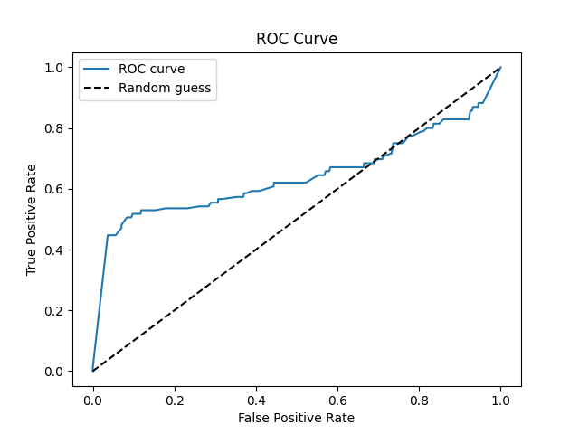
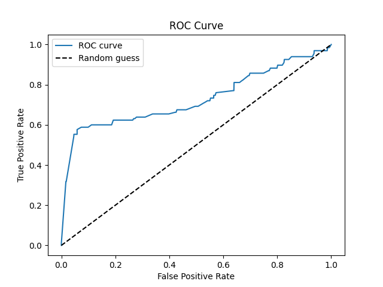
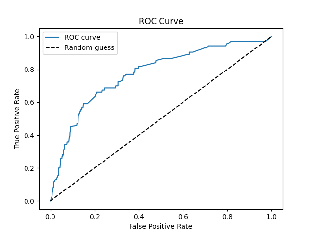
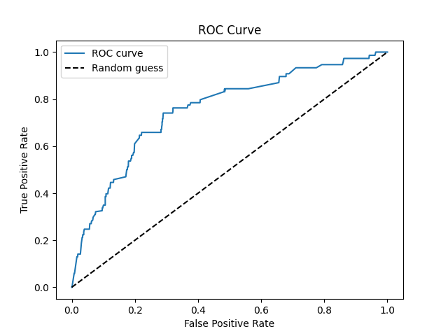

# Результаты работы алгоритмов кластеризации изображений на выпуски периодических изданий.

Результаты работы по обработке 1696 изображений, собранных с 85 изданий, из специально подготовленного набора данных
представлены в таблице 1. Алгоритм SM (symmetric matcher) реализован по статье [1]
При работе алгоритмов использовались 7 изображений логотипов газет и журналов, входящих в набор.

Таблица 1 - Результаты работы классических алгоритмов в задаче поиска титульных страниц выпусков по логотипам.

| Алгоритмы   | Среднее время обработки 1 изображения, с | Оптимальный порог | Оптимальный F1 | Оптимальный accuracy | Оптимальный precision | Оптимальный recall | ROCAUC |
|-------------|------------------------------------------|-------------------|----------------|----------------------|-----------------------|--------------------|--------|
| SIFT+BF     | 14с                                      | 0.7146            | 0.4176         | 0.9375               | 0.3918                | 0.4471             | 0.6410 |
| SIFT+FLANN  | 11с                                      | 0.6957            | 0.4541         | 0.9334               | 0.3852                | 0.5529             | 0.7303 |
| SIFT+SM     |                                          |                   |                |                      |                       |                    |        |
| ORB+BF      |                                          |                   |                |                      |                       |                    |        |
| ORB+FLANN   |                                          |                   |                |                      |                       |                    |        |
| ORB+SM      |                                          |                   |                |                      |                       |                    |        |
| KAZE+BF     | 29c                                      | 0.5091            | 0.2815         | 0.8856               | 0.2041                | 0.4524             | 0.7731 |
| KAZE+FLANN  | 29c                                      | 0.5652            | 0.2471         | 0.9245               | 0.2471                | 0.2471             | 0.7546 |
| KAZE+SM     |                                          |                   |                |                      |                       |                    |        |
| AKAZE+BF    |                                          |                   |                |                      |                       |                    |        |
| AKAZE+FLANN |                                          |                   |                |                      |                       |                    |        |
| AКAZE+SM    |                                          |                   |                |                      |                       |                    |        |

Рисунок 1 - Кривая ROC AUC алгоритма SIFT+BF  
  
Рисунок 2 - Кривая ROC AUC алгоритма SIFT+FLANN  
  
Рисунок 3 - Кривая ROC AUC алгоритма SIFT+SM

Рисунок 4 - Кривая ROC AUC алгоритма ORB+BF

Рисунок 5 - Кривая ROC AUC алгоритма ORB+FLANN

Рисунок 6 - Кривая ROC AUC алгоритма ORB+SM

Рисунок 7 - Кривая ROC AUC алгоритма KAZE+BF  
  
Рисунок 8 - Кривая ROC AUC алгоритма KAZE+FLANN  
  
Рисунок 9 - Кривая ROC AUC алгоритма KAZE+SM

Рисунок 10 - Кривая ROC AUC алгоритма AKAZE+BF

Рисунок 11 - Кривая ROC AUC алгоритма AKAZE+FLANN

Рисунок 12 - Кривая ROC AUC алгоритма AКAZE+SM

---
1. Пименов В.Ю. Метод поиска нечетких дубликатов изображений на основе выявления точечных особенностей // Труды РОМИП. 2007-2008. СПб.: НУ ЦСИ, 2008. С. 145-158.
