# Результаты работы алгоритмов кластеризации изображений на выпуски периодических изданий.

Результаты работы по обработке 1696 изображений, собранных с 85 изданий, из специально подготовленного набора данных
представлены в таблицах 1 и 2. Алгоритм SM (symmetric matcher) реализован по статье [1]
При работе алгоритмов использовались 7 изображений логотипов газет и журналов, входящих в набор.

## Работа без предварительной обработки изображений

Таблица 1 - Результаты работы классических алгоритмов в задаче поиска титульных страниц выпусков по логотипам без предварительной обработки изображений.

| Алгоритмы   | match_threshold | Среднее время обработки 1 изображения, с | Оптимальный порог | Оптимальный F1 | Оптимальный accuracy | Оптимальный precision | Оптимальный recall | ROCAUC |
|-------------|-----------------|------------------------------------------|-------------------|----------------|----------------------|-----------------------|--------------------|--------|
| SIFT+BF     | 0.75            | 14                                       | 0.7146            | 0.4176         | 0.9375               | 0.3918                | 0.4471             | 0.6410 |
| SIFT+FLANN  | 0.75            | 11                                       | 0.6957            | 0.4541         | 0.9334               | 0.3852                | 0.5529             | 0.7303 |
| SIFT+SM     | 0.75            | 5                                        | 0,8750            | 0,6316         | 0,9711               | 0,8750                | 0,4941             | 0,7838 |
| ORB+BF      | 0.75            | 2                                        | 0.0175            | 0.2857         | 0.9440               | 0.3958                | 0.2235             | 0.6223 |
| ORB+FLANN   | 0.75            | 2                                        | 0.5581            | 0.1676         | 0.9121               | 0.1579                | 0.1786             | 0.3679 |
| ORB+SM      | 0.75            | 0.9                                      | 0.7661            | 0.1111         | 0.9528               | 1.0                   | 0.0588             | 0.3173 |
| KAZE+BF     | 0.75            | 29                                       | 0.5091            | 0.2815         | 0.8856               | 0.2041                | 0.4524             | 0.7731 |
| KAZE+FLANN  | 0.75            | 29                                       | 0.5652            | 0.2471         | 0.9245               | 0.2471                | 0.2471             | 0.7546 |
| KAZE+SM     | 0.75            | 26                                       | 0.6686            | 0.3621         | 0.9564               | 0.6774                | 0.2471             | 0.6924 |
| AKAZE+BF    | 0.75            | 8                                        | 0.5893            | 0.8497         | 0.9864               | 0.9559                | 0.7647             | 0.9050 |
| AKAZE+FLANN | 0.75            | 8                                        | 0.5385            | 0.8571         | 0.9870               | 0.9565                | 0.7765             | 0.9115 |
| AKAZE+SM    | 0.75            | 3.7                                      | 0.6714            | 0.8028         | 0.9835               | 1.0                   | 0.6706             | 0.8409 |
| SIFT+BF     | 0.95            | 15                                       | 0.2611            | 0.1789         | 0.7618               | 0.1081                | 0.5176             | 0.5328 |
| SIFT+FLANN  | 0.95            | 11                                       | 0.2071            | 0.1806         | 0.7217               | 0.1059                | 0.6118             | 0.6034 |
| SIFT+SM     | 0.95            | 7.7                                      | 0.2427            | 0.7534         | 0.9788               | 0.9016                | 0.6471             | 0.7276 |
| ORB+BF      | 0.95            | 2                                        | 0.0185            | 0.2857         | 0.9440               | 0.3958                | 0.2235             | 0.6223 |
| ORB+FLANN   | 0.95            | 1.6                                      | 0.0201            | 0.0381         | 0.0772               | 0.0195                | 0.8857             | 0.3047 |
| ORB+SM      | 0.95            | 1.5                                      | 0.0295            | 0.1905         | 0.9499               | 0.5000                | 0.1176             | 0.4029 |
| KAZE+BF     | 0.95            | 30                                       | 0.2772            | 0.5238         | 0.9528               | 0.5301                | 0.5176             | 0.7651 |
| KAZE+FLANN  | 0.95            | 30                                       | 0.1786            | 0.6047         | 0.9599               | 0.5977                | 0.6118             | 0.7998 |
| KAZE+SM     | 0.95            | 27                                       | 0.3670            | 0.6577         | 0.9699               | 0.7656                | 0.5765             | 0.7888 |
| AKAZE+BF    | 0.95            | 7.5                                      | 0.0855            | 0.8214         | 0.9823               | 0.8313                | 0.8118             | 0.8637 |
| AKAZE+FLANN | 0.95            | 7                                        | 0.0690            | 0.8313         | 0.9835               | 0.8519                | 0.8118             | 0.8693 |
| AКAZE+SM    | 0.95            | 5                                        | 0.1087            | 0.8263         | 0.9829               | 0.8415                | 0.8118             | 0.8535 |

ROC AUC кривые алгоритмов при match_threshold = 0.75 без предварительной обработки изображений:  
Рисунок 1 - Кривая ROC AUC алгоритма SIFT+BF  
  
Рисунок 2 - Кривая ROC AUC алгоритма SIFT+FLANN  
  
Рисунок 3 - Кривая ROC AUC алгоритма SIFT+SM  
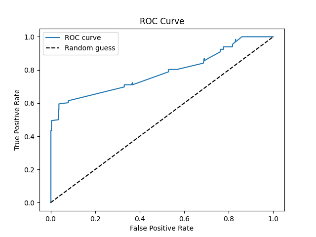  
Рисунок 4 - Кривая ROC AUC алгоритма ORB+BF  
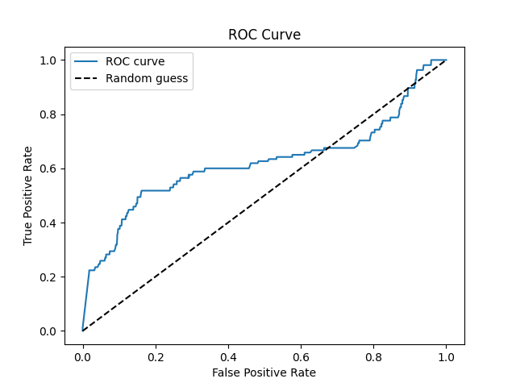  
Рисунок 5 - Кривая ROC AUC алгоритма ORB+FLANN  
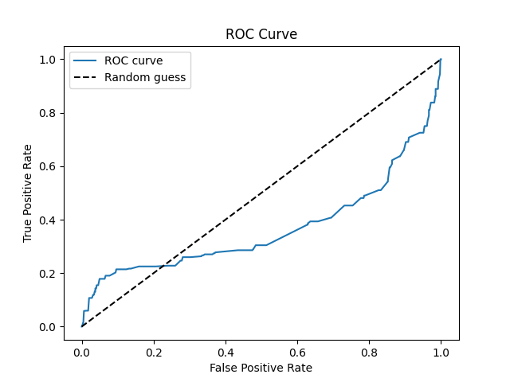  
Рисунок 6 - Кривая ROC AUC алгоритма ORB+SM  
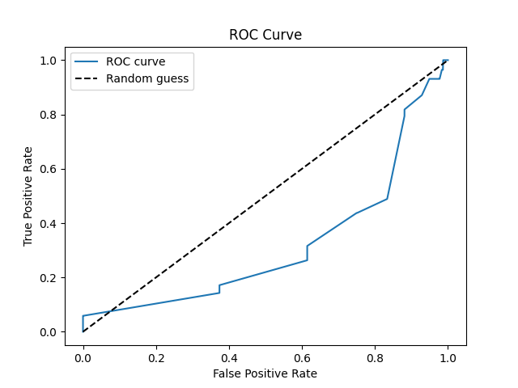  
Рисунок 7 - Кривая ROC AUC алгоритма KAZE+BF  
  
Рисунок 8 - Кривая ROC AUC алгоритма KAZE+FLANN  
  
Рисунок 9 - Кривая ROC AUC алгоритма KAZE+SM  
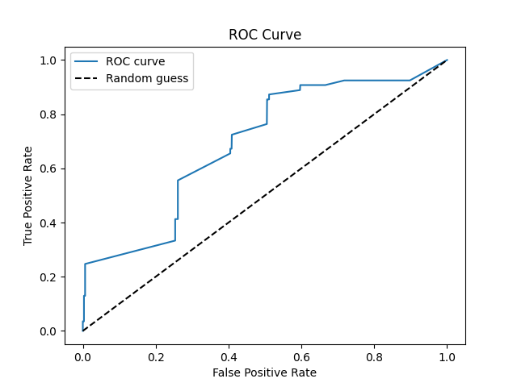  
Рисунок 10 - Кривая ROC AUC алгоритма AKAZE+BF  
  
Рисунок 11 - Кривая ROC AUC алгоритма AKAZE+FLANN  
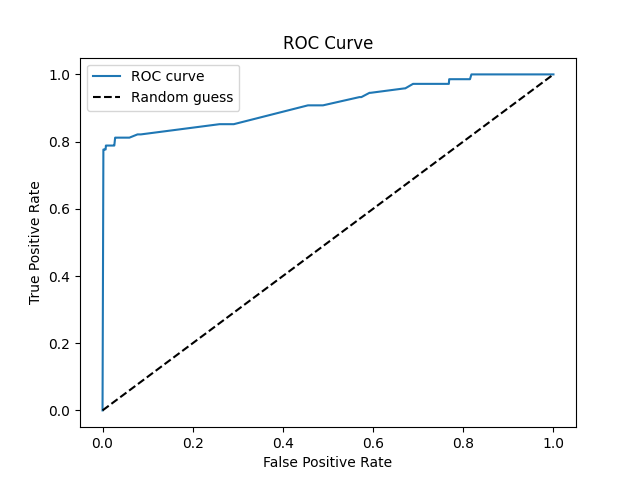  
Рисунок 12 - Кривая ROC AUC алгоритма AКAZE+SM  
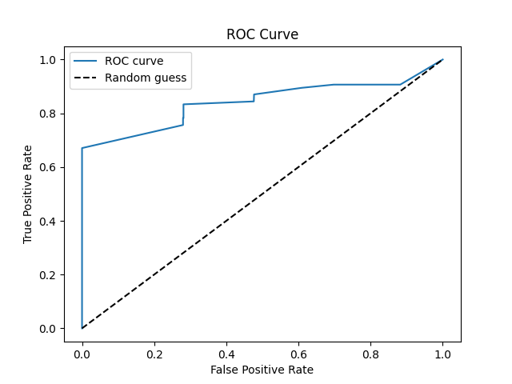  
ROC AUC кривые алгоритмов при match_threshold = 0.95 без предварительной обработки изображений:  
Рисунок 13 - Кривая ROC AUC алгоритма SIFT+BF  
.png)  
Рисунок 14 - Кривая ROC AUC алгоритма SIFT+FLANN  
.png)  
Рисунок 15 - Кривая ROC AUC алгоритма SIFT+SM  
.png)  
Рисунок 16 - Кривая ROC AUC алгоритма ORB+BF  
.png)  
Рисунок 17 - Кривая ROC AUC алгоритма ORB+FLANN  
.png)  
Рисунок 18 - Кривая ROC AUC алгоритма ORB+SM  
.png)  
Рисунок 19 - Кривая ROC AUC алгоритма KAZE+BF  
.png)  
Рисунок 20 - Кривая ROC AUC алгоритма KAZE+FLANN  
.png)  
Рисунок 21 - Кривая ROC AUC алгоритма KAZE+SM  
.png)  
Рисунок 22 - Кривая ROC AUC алгоритма AKAZE+BF  
.png)  
Рисунок 23 - Кривая ROC AUC алгоритма AKAZE+FLANN  
.png)  
Рисунок 24 - Кривая ROC AUC алгоритма AКAZE+SM  
.png)

## Работа с предварительной обработкой изображений

Таблица 2 - Результаты работы классических алгоритмов в задаче поиска титульных страниц выпусков по логотипам с предварительной обработкой изображений.

| Алгоритмы   | match_threshold | Среднее время обработки 1 изображения, с | Оптимальный порог | Оптимальный F1 | Оптимальный accuracy | Оптимальный precision | Оптимальный recall | ROCAUC |
|-------------|-----------------|------------------------------------------|-------------------|----------------|----------------------|-----------------------|--------------------|--------|
| SIFT+BF     | 0.75            | 48                                       | 0.6667            | 0.5479         | 0.9611               | 0.6557                | 0.4706             | 0.6921 |
| SIFT+FLANN  | 0.75            | 13                                       | 0.6691            | 0.5960         | 0.9640               | 0.6818                | 0.5294             | 0.7854 |
| SIFT+SM     | 0.75            | 14                                       | 0.8395            | 0.6512         | 0.9735               | 0.9545                | 0.4941             | 0.6854 |
| ORB+BF      | 0.75            | 2.4                                      | 0.0128            | 0.1810         | 0.8880               | 0.1429                | 0.2471             | 0.4560 |
| ORB+FLANN   | 0.75            | 1.7                                      | 0.51              | 0.07           | 0.94                 | 0.15                  | 0.05               |        |
| ORB+SM      | 0.75            | 1.2                                      | 0.7143            | 0.0674         | 0.9511               | 0.7500                | 0.0353             | 0.3501 |
| KAZE+BF     | 0.75            | 49                                       | 0.4713            | 0.1783         | 0.8479               | 0.1223                | 0.3294             | 0.5456 |
| KAZE+FLANN  | 0.75            | 39                                       | 0.5463            | 0.2270         | 0.9157               | 0.2100                | 0.2471             | 0.5881 |
| KAZE+SM     | 0.75            | 37                                       | 0.6711            | 0.2778         | 0.9540               | 0.6250                | 0.1786             | 0.6177 |
| AKAZE+BF    | 0.75            | 16                                       | 0.4651            | 0.8158         | 0.9835               | 0.9254                | 0.7294             | 0.9359 |
| AKAZE+FLANN | 0.75            | 9.7                                      | 0.4667            | 0.7483         | 0.9782               | 0.8871                | 0.6471             | 0.8410 |
| AKAZE+SM    | 0.75            | 5.7                                      | 0.6678            | 0.7121         | 0.9776               | 1.0                   | 0.5529             | 0.8351 |
| SIFT+BF     | 0.95            |                                          |                   |                |                      |                       |                    |        |
| SIFT+FLANN  | 0.95            |                                          |                   |                |                      |                       |                    |        |
| SIFT+SM     | 0.95            |                                          |                   |                |                      |                       |                    |        |
| ORB+BF      | 0.95            |                                          |                   |                |                      |                       |                    |        |
| ORB+FLANN   | 0.95            |                                          |                   |                |                      |                       |                    |        |
| ORB+SM      | 0.95            |                                          |                   |                |                      |                       |                    |        |
| KAZE+BF     | 0.95            |                                          |                   |                |                      |                       |                    |        |
| KAZE+FLANN  | 0.95            |                                          |                   |                |                      |                       |                    |        |
| KAZE+SM     | 0.95            |                                          |                   |                |                      |                       |                    |        |
| AKAZE+BF    | 0.95            | 16                                       | 0.0415            | 0.800          | 0.9805               | 0.8250                | 0.7765             | 0.8785 |
| AKAZE+FLANN | 0.95            | 10                                       | 0.0338            | 0.7662         | 0.9788               | 0.8551                | 0.6941             | 0.8364 |
| AКAZE+SM    | 0.95            | 8                                        | 0.0275            | 0.8023         | 0.9800               | 0.7931                | 0.8118             | 0.8367 |

ROC AUC кривые алгоритмов при match_threshold = 0.75 без предварительной обработки изображений:  
Рисунок 25 - Кривая ROC AUC алгоритма SIFT+BF  
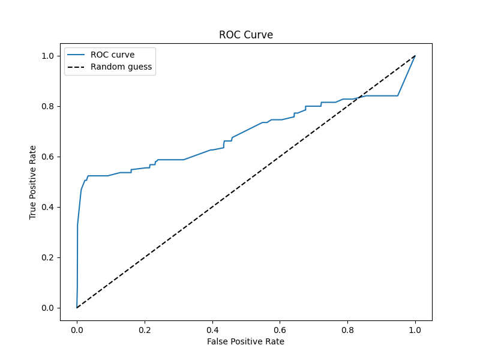  
Рисунок 26 - Кривая ROC AUC алгоритма SIFT+FLANN  
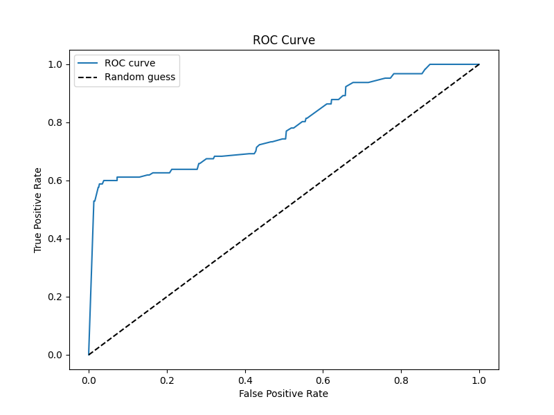  
Рисунок 27 - Кривая ROC AUC алгоритма SIFT+SM  
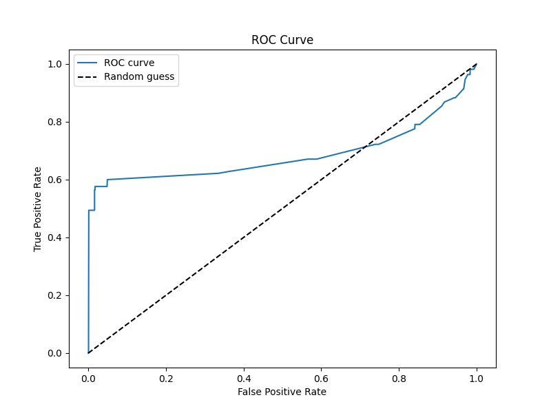  
Рисунок 28 - Кривая ROC AUC алгоритма ORB+BF  
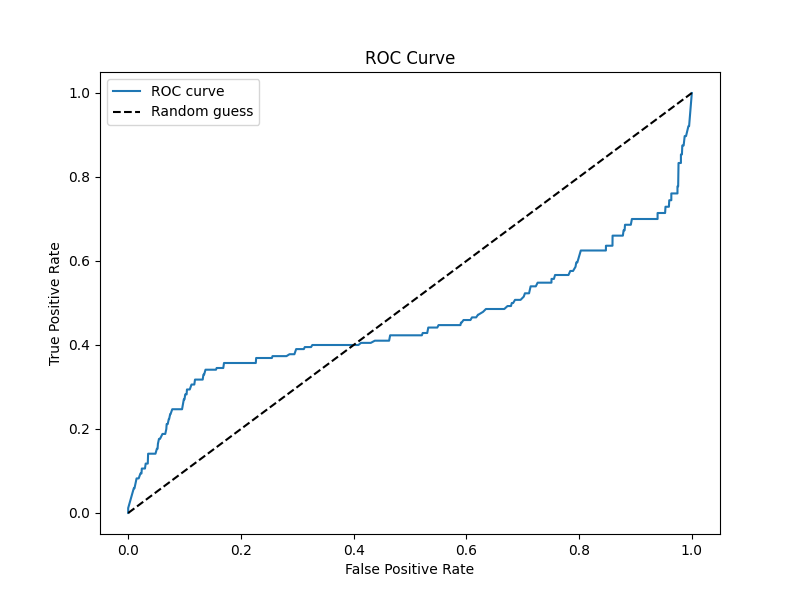  
Рисунок 29 - Кривая ROC AUC алгоритма ORB+FLANN  
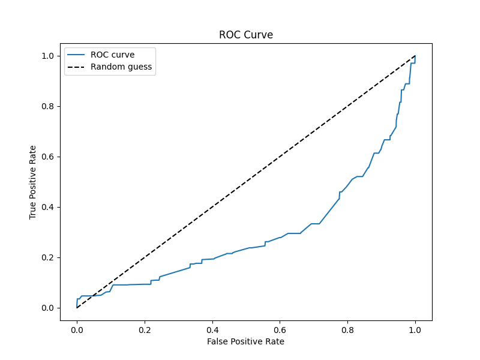  
Рисунок 30 - Кривая ROC AUC алгоритма ORB+SM  
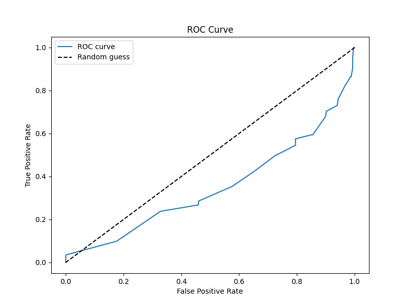  
Рисунок 31 - Кривая ROC AUC алгоритма KAZE+BF  
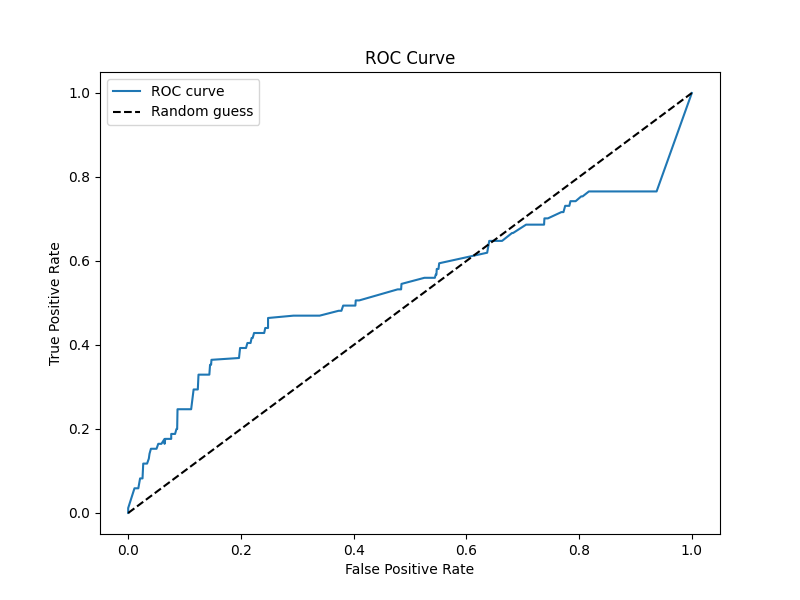  
Рисунок 32 - Кривая ROC AUC алгоритма KAZE+FLANN  
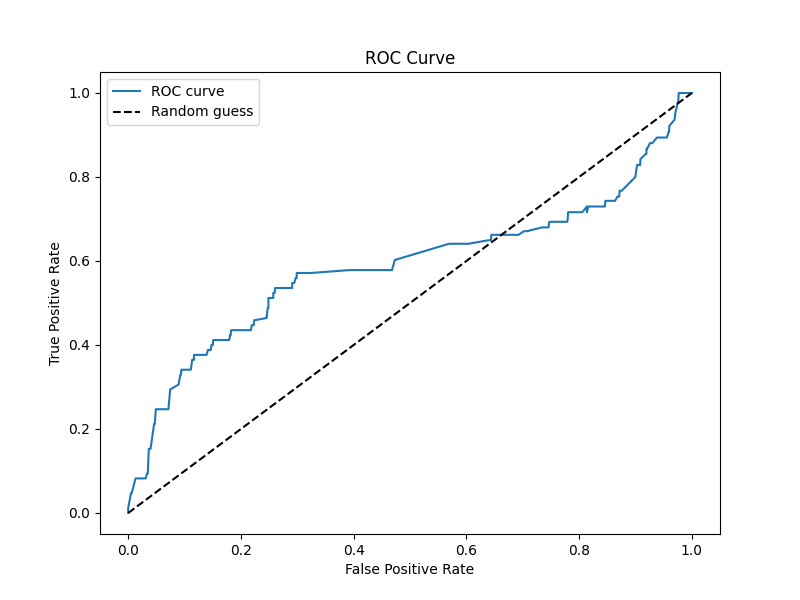  
Рисунок 33 - Кривая ROC AUC алгоритма KAZE+SM  
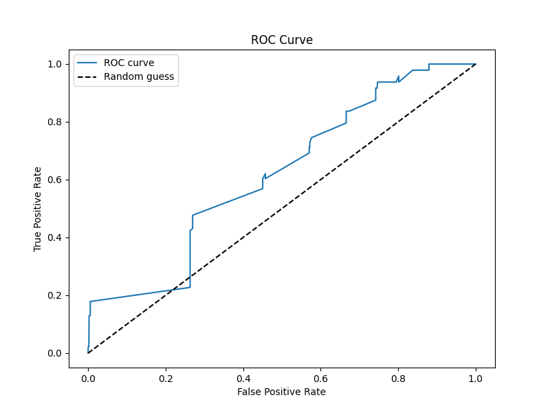  
Рисунок 34 - Кривая ROC AUC алгоритма AKAZE+BF  
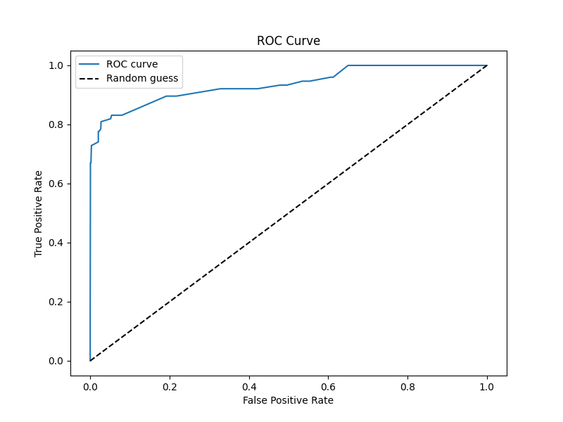  
Рисунок 35 - Кривая ROC AUC алгоритма AKAZE+FLANN  
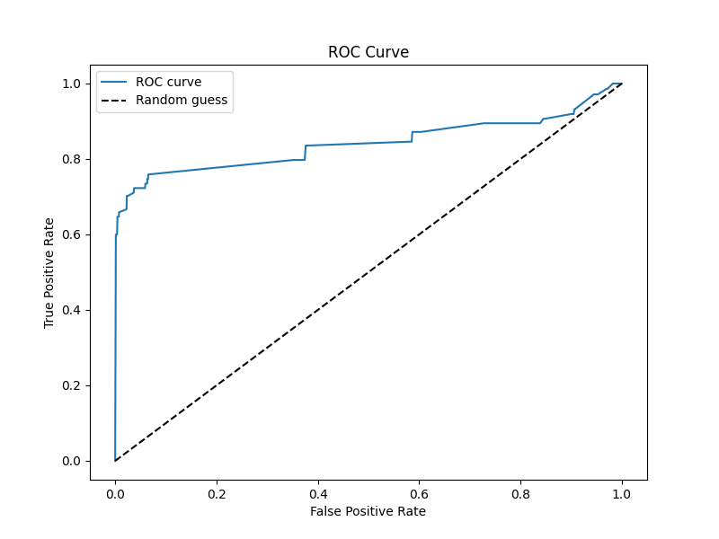  
Рисунок 36 - Кривая ROC AUC алгоритма AКAZE+SM  
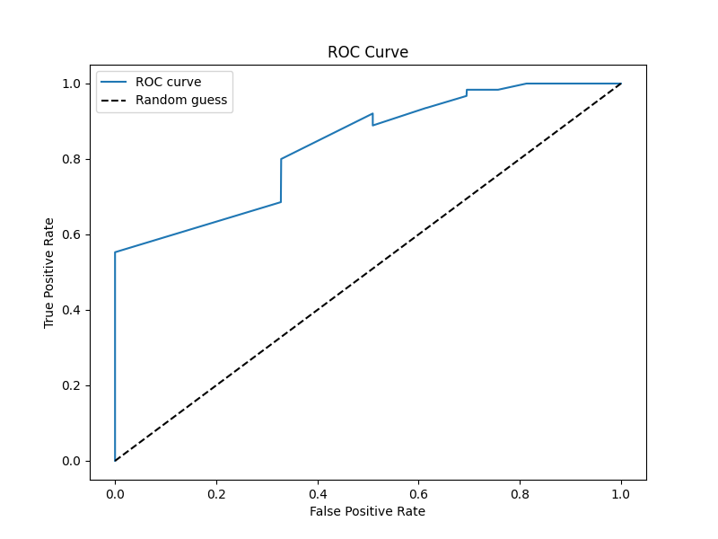  
ROC AUC кривые алгоритмов при match_threshold = 0.95 без предварительной обработки изображений:  
Рисунок 37 - Кривая ROC AUC алгоритма SIFT+BF  
  
Рисунок 38 - Кривая ROC AUC алгоритма SIFT+FLANN  
  
Рисунок 39 - Кривая ROC AUC алгоритма SIFT+SM  
  
Рисунок 40 - Кривая ROC AUC алгоритма ORB+BF  
  
Рисунок 41 - Кривая ROC AUC алгоритма ORB+FLANN  
  
Рисунок 42 - Кривая ROC AUC алгоритма ORB+SM  
  
Рисунок 43 - Кривая ROC AUC алгоритма KAZE+BF  
  
Рисунок 44 - Кривая ROC AUC алгоритма KAZE+FLANN  
  
Рисунок 45 - Кривая ROC AUC алгоритма KAZE+SM  
  
Рисунок 46 - Кривая ROC AUC алгоритма AKAZE+BF  
_pp.png)  
Рисунок 47 - Кривая ROC AUC алгоритма AKAZE+FLANN  
_pp.png)  
Рисунок 48 - Кривая ROC AUC алгоритма AКAZE+SM  
_pp.png)

## Работа с предварительной обработкой изображений без CLAHE

Таблица 3 - Результаты работы классических алгоритмов в задаче поиска титульных страниц выпусков по логотипам с предварительной обработкой изображений и ядром гауссова размытия 9х9.

| Алгоритмы   | match_threshold | Среднее время обработки 1 изображения, с | Оптимальный порог | Оптимальный F1 | Оптимальный accuracy | Оптимальный precision | Оптимальный recall | ROCAUC |
|-------------|-----------------|------------------------------------------|-------------------|----------------|----------------------|-----------------------|--------------------|--------|
| AKAZE+BF    | 0.75            | 7.6                                      | 0.5011            | 0.8144         | 0.9817               | 0.8293                | 0.8000             | 0.9188 |
| AKAZE+FLANN | 0.75            | 6.9                                      | 0.5091            | 0.8133         | 0.9835               | 0.9385                | 0.7176             | 0.9097 |
| AKAZE+SM    | 0.75            | 3.9                                      | 0.6805            | 0.7591         | 0.9805               | 1.0                   | 0.6118             | 0.8402 |
| AKAZE+BF    | 0.65            | 7.7                                      | 0.4667            | 0.8734         | 0.9882               | 0.9452                | 0.8118             | 0.9032 |
| AKAZE+FLANN | 0.65            | 7                                        | 0.5496            | 0.8758         | 0.9888               | 0.9853                | 0.7882             | 0.8885 |
| AKAZE+SM    | 0.65            | 3.9                                      | 0.6829            | 0.7832         | 0.9817               | 0.9655                | 0.6588             | 0.8942 |
| AKAZE+BF    | 0.6             | 7.7                                      | 0.4074            | 0.8625         | 0.9870               | 0.9200                | 0.8118             | 0.9049 |
| AKAZE+FLANN | 0.6             | 6.8                                      | 0.5238            | 0.8903         | 0.9900               | 0.9857                | 0.8118             | 0.9026 |
| AКAZE+SM    | 0.6             | 4.4                                      | 0.4571            | 0.8571         | 0.9864               | 0.9079                | 0.8118             | 0.9051 |

ROC AUC кривые алгоритмов при match_threshold = 0.75:  
Рисунок 49 - Кривая ROC AUC алгоритма AKAZE+BF  
_pp2.png)  
Рисунок 50 - Кривая ROC AUC алгоритма AKAZE+FLANN  
_pp2.png)  
Рисунок 51 - Кривая ROC AUC алгоритма AКAZE+SM  
_pp2.png)  
ROC AUC кривые алгоритмов при match_threshold = 0.65:  
Рисунок 52 - Кривая ROC AUC алгоритма AKAZE+BF  
_pp2.png)  
Рисунок 53 - Кривая ROC AUC алгоритма AKAZE+FLANN  
_pp2.png)  
Рисунок 54 - Кривая ROC AUC алгоритма AКAZE+SM  
_pp2.png)
ROC AUC кривые алгоритмов при match_threshold = 0.6:  
Рисунок 46 - Кривая ROC AUC алгоритма AKAZE+BF  
_pp2.png)  
Рисунок 47 - Кривая ROC AUC алгоритма AKAZE+FLANN  
_pp2.png)  
Рисунок 48 - Кривая ROC AUC алгоритма AКAZE+SM  
_pp2.png)
---
1. Пименов В.Ю. Метод поиска нечетких дубликатов изображений на основе выявления точечных особенностей // Труды РОМИП. 2007-2008. СПб.: НУ ЦСИ, 2008. С. 145-158.
