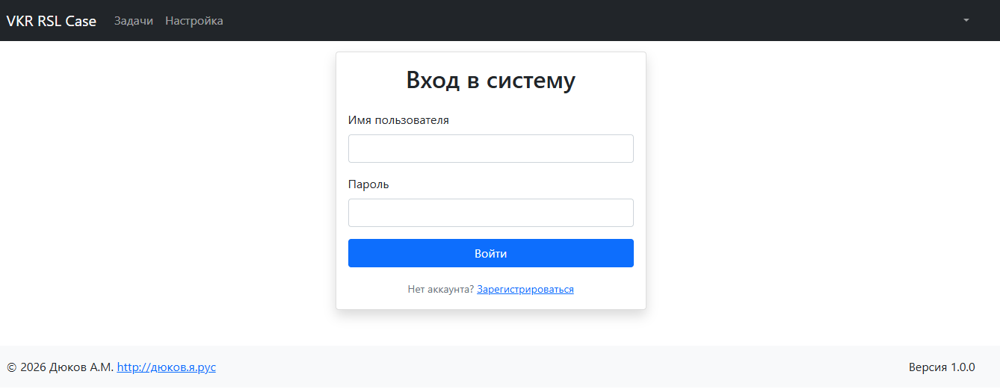
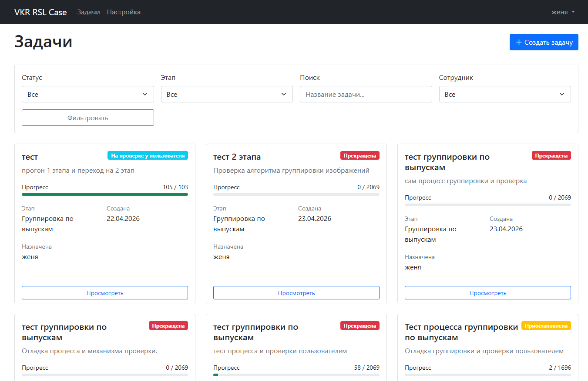
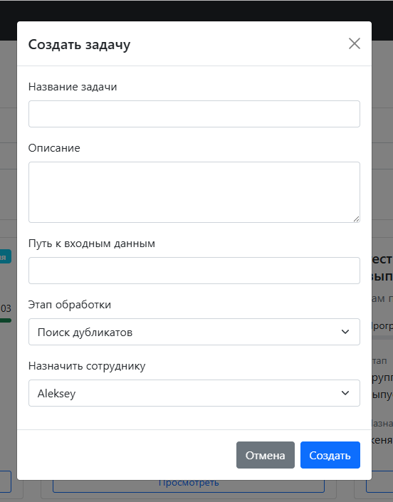
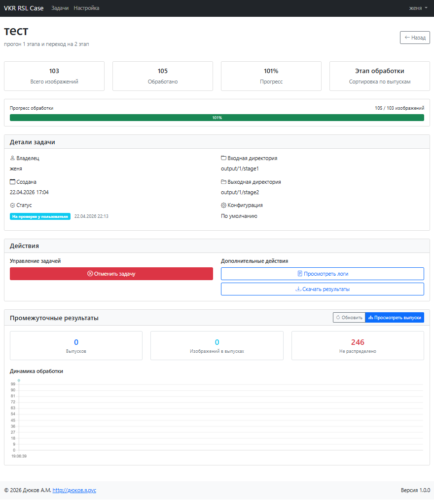
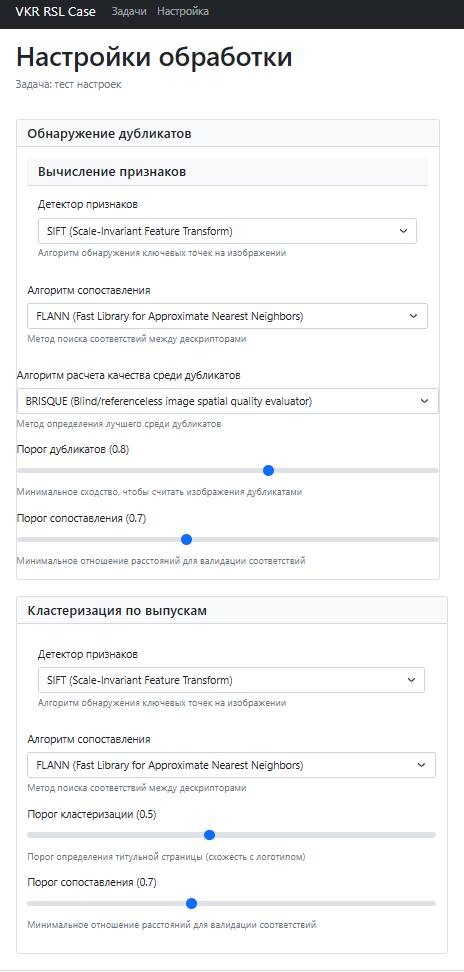
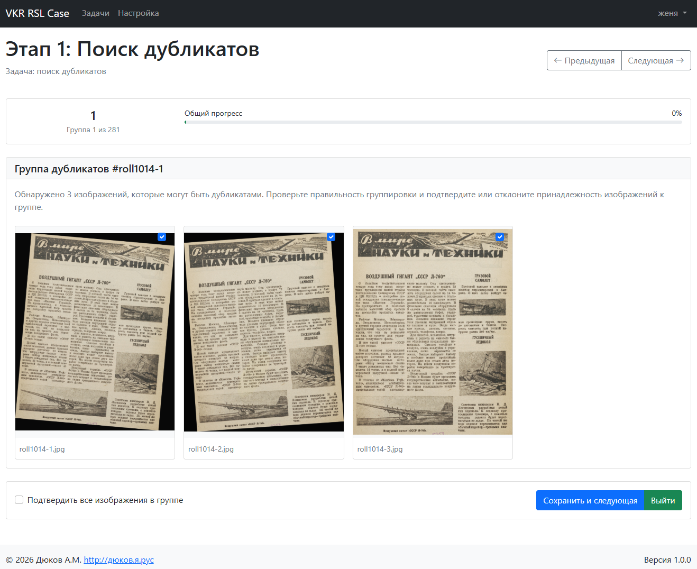
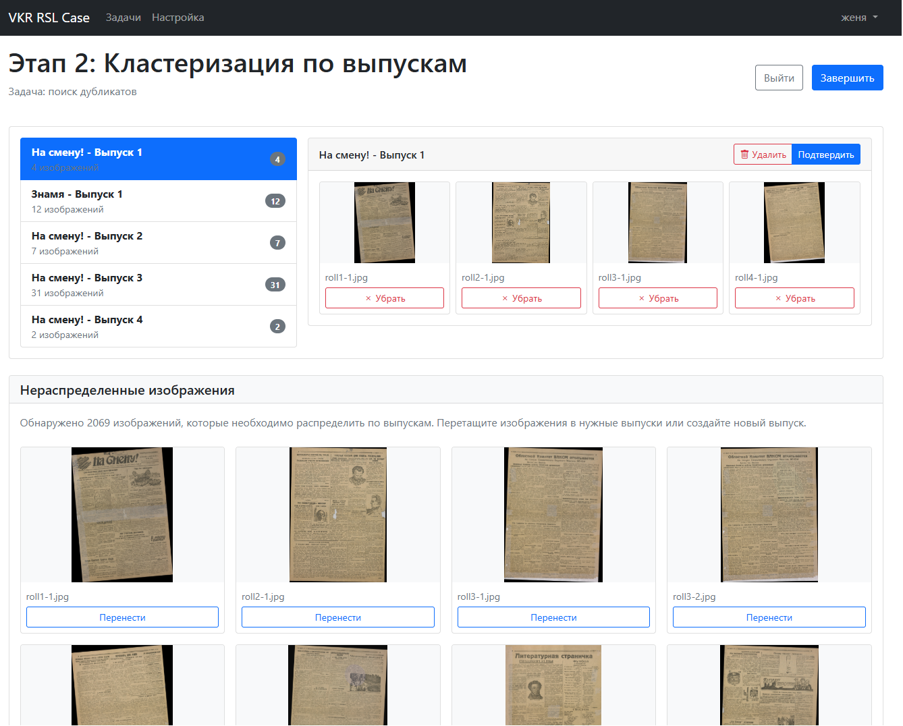
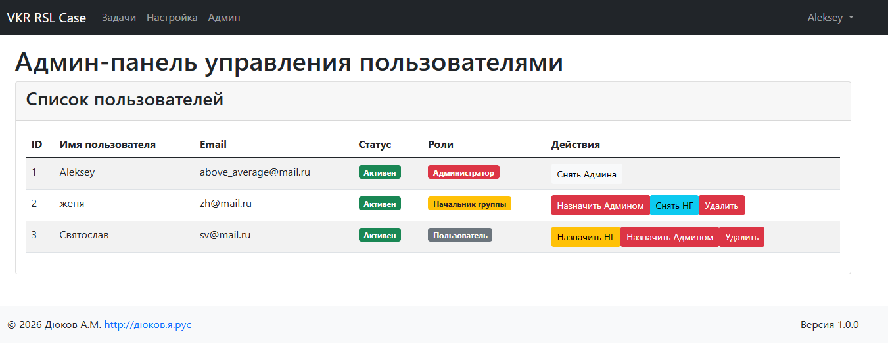
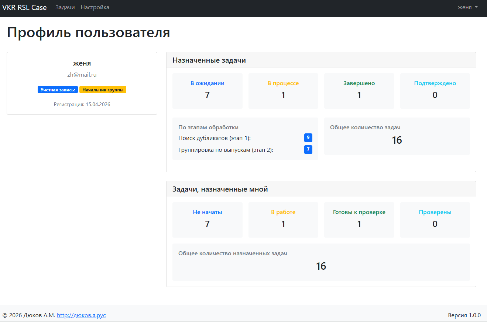

# Руководство по эксплуатации системы VKR RSL Case

Данное руководство описывает порядок работы с системой VKR RSL Case — веб-приложением для обработки изображений, поиска дубликатов и кластеризации по выпускам периодических изданий.

## Содержание

1. [Назначение системы](#назначение-системы)
2. [Регистрация и аутентификация](#регистрация-и-аутентификация)
3. [Интерфейс пользователя](#интерфейс-пользователя)
4. [Создание задачи](#создание-задачи)
5. [Обработка изображений](#обработка-изображений)
   - [Этап 1: Поиск дубликатов](#этап-1-поиск-дубликатов)
   - [Этап 2: Группировка по выпускам](#этап-2-группировка-по-выпускам)
6. [Административные функции](#административные-функции)
7. [Профиль и статистика](#профиль-и-статистика)

## Назначение системы

Система предназначена для автоматизированной обработки больших объемов изображений, включая:
- Поиск дубликатов на основе визуального сходства
- Ручную верификацию групп дубликатов
- Кластеризацию изображений по выпускам периодических изданий (например, журналов, газет) на основе анализа логотипов
- Управление задачами и отслеживание прогресса

Система поддерживает двухэтапную обработку, где первый этап — анализ изображений на дубликаты, а второй — классификация по выпускам.

## Запуск приложения

Приложение может быть запущено на локальном ПК командой:
```uvicorn main:app```, или в локальной сети командой ```uvicorn --host=x.x.x.x```, где x.x.x.x – IP-адрес сервера.

## Регистрация и аутентификация

Для начала работы с системой необходимо зарегистрироваться или войти в существующий аккаунт. Переход к страницам аутентификации осуществляется автоматически при попытке доступа к защищенным ресурсам, либо через ссылки в интерфейсе.

- **Вход в систему**: Адрес страницы — `/auth/login`. Пользователь попадает сюда при попытке доступа к системе без активной сессии. На странице расположена форма с полями для имени пользователя и пароля, а также кнопка "Войти".
- **Регистрация**: Адрес — `/auth/register`. Ссылка "Зарегистрироваться" находится под формой входа. Форма регистрации включает поля: имя пользователя, email, пароль и опциональный флажок "Администратор" для создания учетной записи с расширенными правами.



## Интерфейс пользователя

После успешной аутентификации пользователь автоматически перенаправляется на страницу списка задач (`/tasks`). Интерфейс системы имеет следующие элементы:

- **Навигационная панель** в верхней части страницы с меню:
  - `Задачи` — ведет на главную страницу списка задач.
  - `Настройка` — открывает модальное окно с глобальными параметрами обработки изображений (доступно для всех).
  - `Админ` — ведет на `/admin`, доступно только для суперпользователей.
  - Профиль пользователя в правой части — при клике открывается выпадающее меню с пунктами "Профиль" (переход на `/auth/profile`) и "Выход" (переход на `/auth/logout`).

- **Карточки задач**, отображающие название, описание, статус, прогресс и другую информацию.
- **Панель фильтров** с возможностью поиска задач по статусу, этапу, тексту и сотруднику (последнее — только для начальников групп).
- **Пагинация** при большом количестве задач.
- Кнопка **"Создать задачу"** — доступна только начальникам групп и открывает модальное окно создания задачи.



## Создание задачи

Только пользователи с правами начальника группы могут создавать новые задачи. Для этого:

1. Нажмите кнопку **"Создать задачу"**.
2. Заполните форму:
   - Название задачи
   - Описание
   - Путь к входным данным
   - Этап обработки (поиск дубликатов или группировка по выпускам)
   - При выборе этапа группировки — укажите путь к папке с логотипами
   - Назначьте задачу сотруднику
3. Нажмите **"Создать"**.

Созданная задача появится в списке задач с начальным статусом "Ожидание".



## Обработка изображений

Пользователь может открыть любую из задач, назначенных ему или назначенных им для просмотра текущего состояния.



### Подготовка перед запуском

Пользователь перед запуском может изменить параметры по-умолчанию настройки алгоритмов поиска дубликатов и группировки выпусков.
Для этого перед запуском задачи на странице задачи нужно нажать на кнопку "Настройки обработки", доступную только до запуска выполнения.



### Этап 1: Поиск дубликатов

После запуска задачи на поиск дубликатов система автоматически анализирует изображения и группирует потенциальные дубликаты. Далее требуется ручная верификация:

1. На странице задачи (`/tasks/{id}`) нажмите кнопку **"Просмотреть дубликаты"**, которая становится доступной после запуска обработки.
2. Система перейдет на страницу `/processing/stage1/{task_id}`, где отобразит первую группу потенциальных дубликатов.
3. Просмотрите каждую группу: оставьте галочки только на изображениях, которые действительно являются дубликатами.
4. Навигация по группам осуществляется с помощью кнопок **"Предыдущая"** и **"Следующая"**.
5. Для сохранения текущей группы и перехода к следующей нажмите **"Сохранить и следующая"**.
6. По завершении нажмите **"Выйти"**, чтобы вернуться на страницу задачи.



### Этап 2: Группировка по выпускам

После завершения первого этапа задача может быть переведена на второй этап — группировку по выпускам. Для этого:

1. На странице задачи (`/tasks/{id}`) нажмите кнопку **"Группировка по выпускам"**, которая доступна только начальнику группы при статусе "Завершено" и этапе 1.
2. Введите путь к папке с логотипами и подтвердите запуск. Система обработает изображения и сгруппирует их по потенциальным выпускам.
3. После завершения автоматической группировки нажмите кнопку **"Просмотреть выпуски"**, чтобы перейти на страницу `/processing/stage2/{task_id}`.
4. Страница включает:
   - Список созданных выпусков слева.
   - Содержимое выбранного выпуска справа.
   - Блок с нераспределенными изображениями внизу.
5. Чтобы создать выпуск:
   - Нажмите **"Создать выпуск"**, введите название (например, "Огонек") и подтвердите. Номер выпуска присваивается автоматически.
6. Чтобы распределить изображения:
   - Перетащите изображение из блока "Нераспределенные изображения" в нужный выпуск.
   - Или нажмите кнопку **"Перенести"** под изображением, выберите выпуск из списка или создайте новый.
7. По завершению распределения нажмите **"Завершить"**.

Также можно сразу создать задачу на выполнение группировки по выпускам на странице задач. Для этого нужно выбрать при создании соответствующий этап.



## Административные функции

Пользователи с правами суперпользователя имеют доступ к админ-панели по адресу `/admin`, который можно найти в навигационной панели. Здесь можно:

- Просматривать список всех пользователей
- Назначать и снимать роли: "Начальник группы" и "Администратор"
- Удалять пользователей (кроме самого себя)

Изменения вносятся с помощью кнопок в строках таблицы пользователей.



## Профиль и статистика

На страницу профиля (`/auth/profile`) можно попасть, выбрав пункт "Профиль" в выпадающем меню в правом верхнем углу интерфейса. Здесь пользователь может просмотреть:

- Общее количество задач
- Количество задач по статусам: ожидание, в процессе, завершено, подтверждено
- Количество задач по этапам
- Статистику по задачам, назначенным пользователем (для начальников групп)


